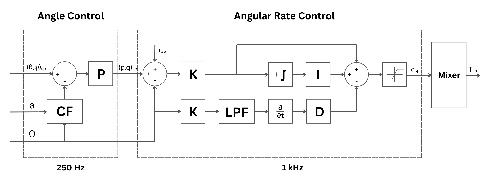

# Work in Progress

# Firmware -> Flight-Controller V1.2
This firmware was written completely from the ground up in bare-metal C and implements "angle-mode" flight stabilization of symmetric quadcopter X frame. The drone can be externally controlled using any Crossfire Serial Protocol (CRSF) radio connected via the radio JST-GH port (USART1). The drone is stabilized using data from the onboard BMI270 Intertial Measurement Unit (IMU), Radio setpoints, and 2 cascaded control loops.

## System Architecture and Control  

### Stabilization

The control of the drone is based on a deterministic 1 kHz loop triggered by interrupts on timer 6.

Angle setpoints are provided by the radio through UART and are processed at 250Hz by a complementary filter that combines the accelerometer and the discrete integral of gyro data at a ratio of 98:2, and multiplied by a constant to provide the roll and pitch setpoints.

The angle setpoints–roll and pitch from the angle controller, and yaw from the radio–are fed into a K-PID controller operating at 1 kHz. The controller notably creates the D term using a Low Pass Filter (LPF) from the discrete derivative of the gyro rates. Additionally, the integral and sum of the PID terms are clamped and fed into a mixer that calculates the individual motor throttles.

### Finite State Machine
A finite state machine (FSM) is used to process the radio bytes and store the data into a circular memory buffer, allowing for the assembly of the radio packets to be non-blocking.

### Direct Memory Access
Direct Memory Access (DMA) is used to directly store the radio packets in the circular buffer from the UART connection (RX) and to create the PWM signals required for D-shot300 to drive the motor ESCs (TX). DMA allows for the two functions to work background.

## Notes
The Tim2 is used to generate D-Shot300. The flight controller should be positioned such that the +ive x-axis is facing forward and the +ive z-axis downwards. The following are the mappings for the motor to the channels:  

| Ch1 | Ch2 | Ch3 | Ch4 |
|-----|-----|-----|-----|
| A   | B   | C   | D   |

## Tuning Procedure
Tune the angle rate controllers first
1. Start with only a low K value (say 1.0)
2. 

## Next Steps
- Altitude hold using onboard barometer
- Position hold using GPS (look into quaternions)
- FSM for state of the drone (armed vs not)
- Integrate onboard SD card
- Integrate onboard buzzer and leds for flight state

## Helpful Documents
https://github.com/betaflight/betaflight
https://github.com/ArduPilot/ardupilot/tree/master/ArduCopter
https://docs.px4.io/main/en/flight_stack/controller_diagrams  
https://betaflight.com/docs/development/API/Dshot   
https://github.com/tbs-fpv/tbs-crsf-spec/blob/main/crsf.md  
https://www.bosch-sensortec.com/media/boschsensortec/downloads/datasheets/bst-bmi270-ds000.pdf    

