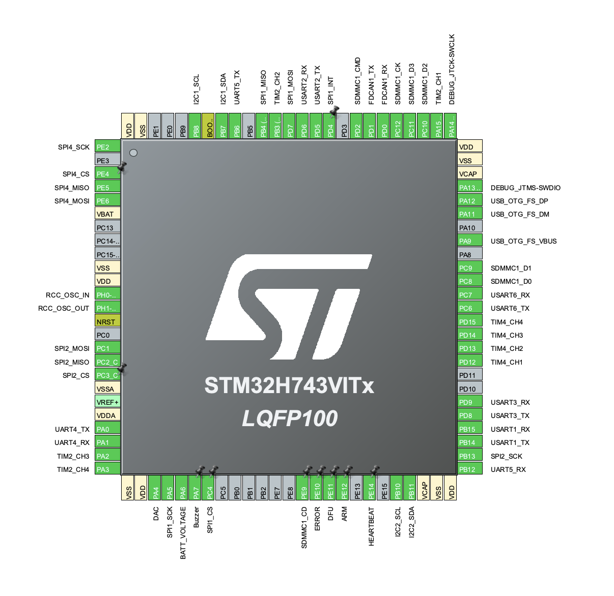
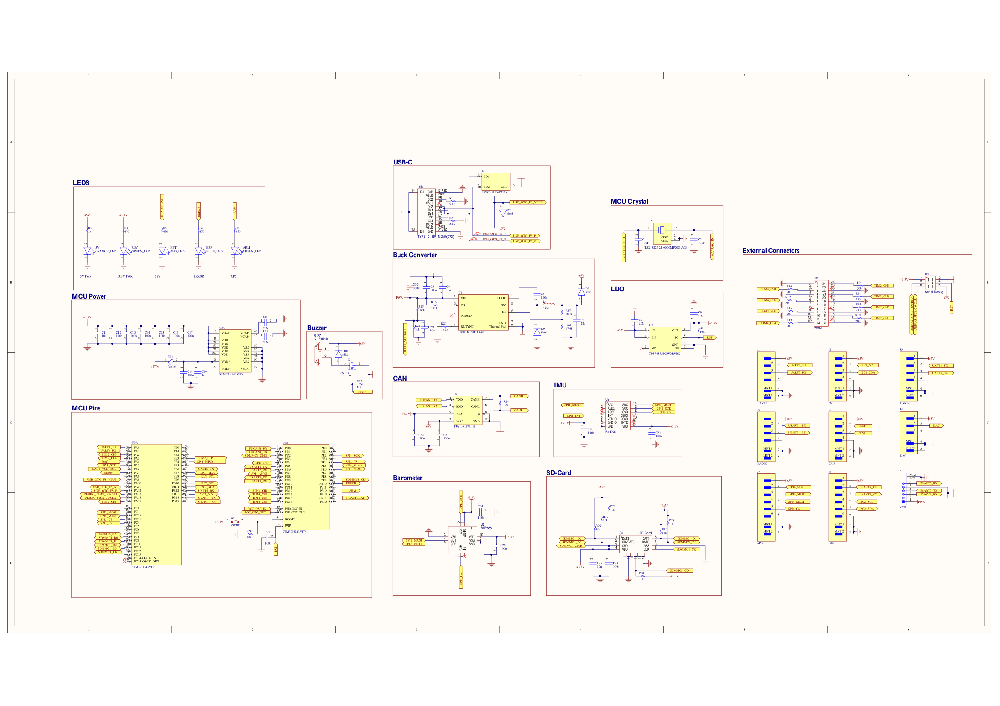
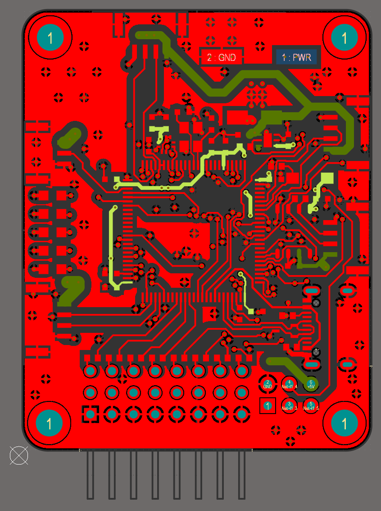
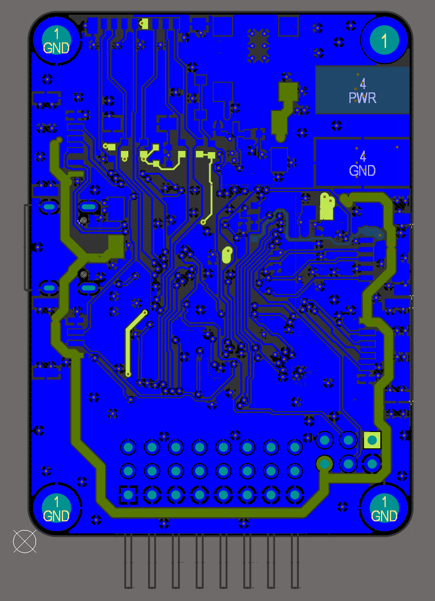
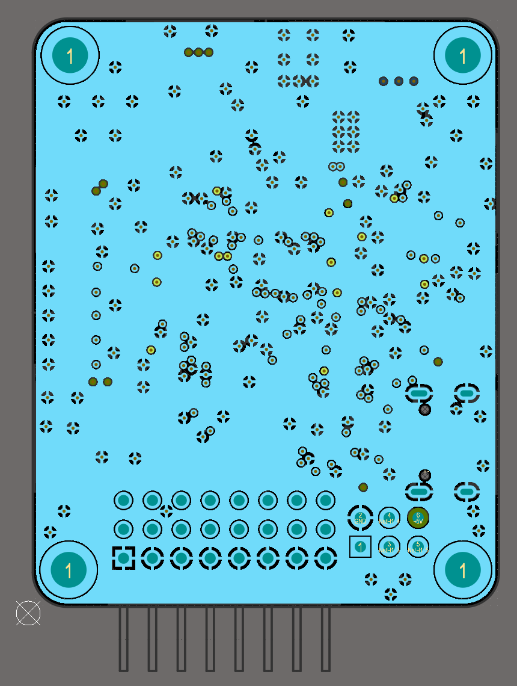

# [Firmware -> Flight-Controller V1.2](Firmware/README.md)
# [Arducopter -> Flight-Controller V1.2](Arducopter/README.md)

# Hardware -> Flight-Controller V1.2

The purpose of this project was to gain experience working on a 4-layer PCB layout with Altium and working with the ARM STM32 family of microcontrollers. Communication protocols such as SPI, UART, I2C, CAN, and USB were explored.  
Going forward, this board will serve as a testbed for the testing of control algorithms and can interface with an external flight computer such as a jetson nano for tasks such as computer vision and advanced autonomous flight. 

This board will also be designed to optionally run the [Ardupilot](https://ardupilot.org/) firmware for autonomous flight and initial testing.  
This board can also support the DJI Air unit system through the VTX connector.

This board is a part of my interest to building the entire hardware and software stack for a drone (Project Drone Full Stack PDFS).

## Improvements from V1.1
1. Complete re-routing of all signal traces for better signal integrity
2. Reduction of total board size
3. Improved silkscreen descriptors of ports and features

## Improvements from V1.0
1. Inductor with higher saturation and max current chosen for Buck Converter
2. Swapped TPS7A2033PDBVR for the TPS74533PQWDRVRQ which has higher max current supply
3. Buzzer moved from PE8 to PA4 (Pin with PWM timer)
4. SD-Card correctly realigned
5. Both 5.1k CC resistors for USB-C attached to ground
6. Removed DFU LED

## Features

| Feature                   | Capability                            |
|---------------------------|---------------------------------------|
| Processor                 | STM32H743VIT6                         |
| Clock Speed               | 480MHz                                |
| Flash Memory              | 2 MB                                  |
| PWM/D-Shot                | 8 (4 TIM2 & 4 TIM4)                   |
| Inertial Measurement Unit | BMI270                                |
| Barometer                 | BMP388                                |
| UART (external)           | 5 (USART1 USART2 USART3 UART4 USART6) |
| SPI  (external)           | 1 (SPI4)                              |
| CAN bus                   | 1                                     |
| Camera Feed               | Digital                               |
| I2C                       | Row 2, Cell 2                         |
| DAC                       | 1                                     |
| Power                     | 5-35V                                 |
| Debugging                 | Serial Debug                          |
| Serial                    | USB-C                                 |
| Logging                   | Micro-SD Card                         |

### Timers
The following timers are from the left of the board to the right.

<table>
  <thead>
    <tr>
      <!-- Adjust the colspan values so they add up to 8 total -->
      <th colspan="4">Timer 4</th>
      <th colspan="4">Timer 2</th>
    </tr>
  </thead>
  <tbody>
    <tr>
      <td>Ch1</td>
      <td>Ch2</td>
      <td>Ch3</td>
      <td>Ch4</td>
      <td>Ch1</td>
      <td>Ch2</td>
      <td>Ch3</td>
      <td>Ch4</td>
    </tr>
  </tbody>
</table>

### Connectors
The external connectors for UART, SPI, CAN, and DAC are JST-GH for secure latching connections.  
The PWM/D-Shot uses 2.54mm pitch male header pins in 3 rows of 8 pins.  
An O3 or O4 DJI Air Unit can connect through the 6-pin JST-SH VTX connector.

## CubeMX
The [STM32CubeMX Software](https://www.st.com/en/development-tools/stm32cubemx.html) was used to determine the power and pinout for the STM32H743VIT6.  

## Schematic

## Board Stackup
Signal Ground Ground Signal (S-G-G-S) was chosen over Signal Ground Power Signal (S-G-P-S) as both signal layers are shielded from each other by a close ground plane.  
There is also better ground reference vias for signals traveling between the outermost layers.  
Standard copper pour is used for signal layers as well as thorough ground stitching.

| Layer | Purpose |
|-------|---------|
| 1     | Signal  |
| 2     | Ground  |
| 3     | Ground  |
| 4     | Signal  |

### Top and Bottom signal layers respectively with copper pours
 

### Internal Ground Plane 2 and 3 respectively   
 

## Routing

### Power
Power is routed through the board using thick PCB traces and many vias. The Board uses a LMR16020 step down simple switcher to get 5V, used to power external peripherals such as radio and GPS.
The TPS74533PQWDRVRQ low dropout regulator is used to further reduce the voltage to 3.3V for the STM32H743 and onboard peripherals.
Such power components were placed in the top right corner to try and isolate the noise they would generate.

### Ground Vias
Anytime a signal traveled between layers, a corresponding ground reference via was placed.

### Signals
Faster or more critical signals were routed first such that they had minimal trace length and travel between layers.   
USB was routed with a differential pair.

Routing Priority: USB, SDMMC, SPI, DAC, CAN, UART, I2C, PWM, GPIO.  

Impedance matching was not done for SDMMC due to a lower speed requirement but length matching (>10mm) was taken into account. 

## Mechanical
Dimensions 41 mm* 51.69 mm. 1.6mm FR4 Board thickness. Four M3 mounting holes on the corners of the board.

## License
[Flight-Controller V1.0](https://github.com/jeffrey500/Flight-Controller) © 2026 by [Jeffrey Zhu](https://jzhu.ca) is licensed under a [Creative Commons Attribution-NonCommercial-ShareAlike 4.0 International License](https://creativecommons.org/licenses/by-nc-sa/4.0/).

