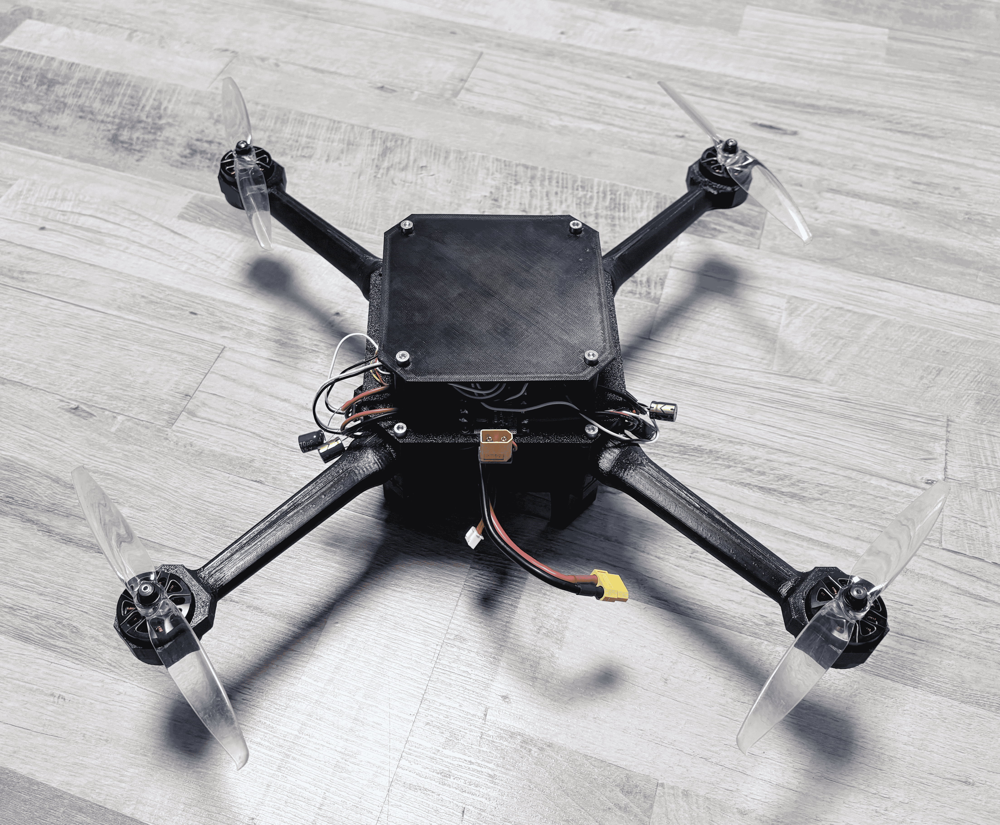
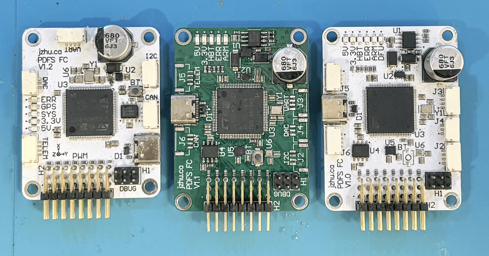

# PDFS Flight Controller

The purpose of this project is:
1. Create a Modular platform for future drone control projects 
2. Gain experience writing firmware for STM32 embedded systems
3. Become familiar more familiar with Altium and 4-layer PCB routing
4. Add to my goal of making the entire system of a drone (Project Drone Full Stack PDFS)

## Highlights

### [Video of Drone Flying](https://youtu.be/c6FY-opbWkY)

 

### [Firmware](Firmware/README.md)  

- "Angle mode" control
- Deterministic 1kHz control loop
- Cascaded PID Control
- Drivers for IMU and CRSF Radio
- Use of Direct Memory Access and Finite State Machines

### [Hardware](Hardware/README.md)

- STM32H743 Microcontroller
- 4-layer stackup + signal integrity considerations
- Integrated IMU, Barometer, Micro-SD, Buzzer, State LEDs
- Direct power from battery
- SPI, UART, I2C, CAN, USB
- 3D-Printed Drone Frame

### [Arducopter](Arducopter/README.md)

- Hardware Definitions for autonomous flight

## Future Use

Advanced control can be facilitated through connecting a flight computer to the flight controller through UART or SPI.

Altitude and position hold should be implemented in the future with the use of the integrated Barameter and external GPS + Compass.

The use of a digital camera system such as the DJI O3/O4 can be connected through the VTX video port.

## License
[Flight-Controller V1.0](https://github.com/jeffrey500/Flight-Controller) © 2026 by [Jeffrey Zhu](https://jzhu.ca) is licensed under a [Creative Commons Attribution-NonCommercial-ShareAlike 4.0 International License](https://creativecommons.org/licenses/by-nc-sa/4.0/).

